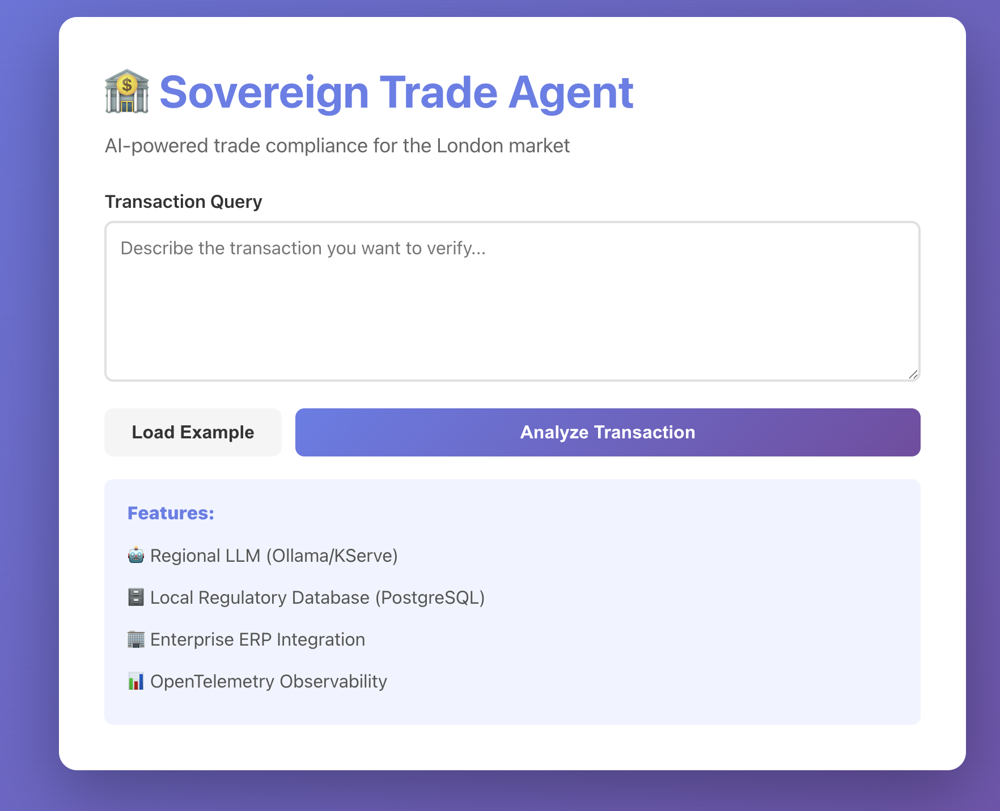
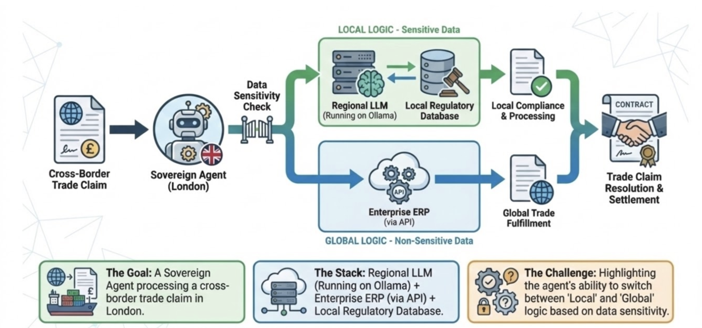

# Sovereign Trade Agent

An AI-powered trade compliance assistant for the London market that uses local LLMs to verify transactions against FCA anti-money laundering (AML) rules.

## Running the application in dev mode

Quarkus Dev Services will automatically start Ollama and OpenTelemetry containers:

```shell script
./mvnw quarkus:dev
```


## Web UI

Access the React-based web interface at <http://localhost:8080>



The UI provides:
- Interactive transaction query form
- Real-time compliance assessment
- Example transaction loader
- Visual feedback for AI agent responses

> **_NOTE:_** Quarkus Dev UI is available at <http://localhost:8080/q/dev/>

## Demo Scenario



### Test the AML Check Tool

Send a transaction query that exceeds the £10,000 threshold:

**Using curl:**
```bash
curl -X POST http://localhost:8080/trade/analyze \
  -H "Content-Type: text/plain" \
  -d "I have a customer, 'London Tech Ltd', trying to move £12,500 to a new vendor in Estonia for 'Cloud Services'. Before I approve this, check our local AML rules."
```

**Expected Response:**
```
REJECTED: Manual FCA review required for amounts over £10k.
```

**Using Dev UI:**
1. Navigate to <http://localhost:8080/q/dev/>
2. Find the REST endpoint `/trade/analyze`
3. Paste the query above
4. Submit

### Verify Telemetry in Grafana

After running the test above, verify that telemetry data is being collected:

1. **Access Grafana Dashboard:**
   - Open Quarkus Dev UI: <http://localhost:8080/q/dev/>
   - Look for "Observability" section
   - Click on the Grafana link (usually <http://localhost:3000>)

2. **View Traces in Tempo:**
   - In Grafana, go to **Explore** (compass icon)
   - Select **Tempo** as the data source
   - Click **Search** tab
   - Filter by:
     - Service Name: `sovereign-trade-agent`
     - Span Name: `checkAMLStatus` or `getCustomerInfo`
   - Click **Run Query**

3. **What You Should See:**
   - Trace showing the full request flow
   - Span for `checkAMLStatus` with attributes:
     - `transaction.amount`: 12500.0
     - `transaction.currency`: GBP
   - Child spans for:
     - PostgreSQL database queries
     - Hibernate ORM operations
   - Total execution time for each operation

4. **View Metrics in Mimir:**
   - In Grafana, go to **Explore**
   - Select **Mimir** as the data source
   - Query: `http_server_requests_seconds_count{uri="/trade/analyze"}`
   - See request counts and response times

5. **View Logs in Loki:**
   - In Grafana, go to **Explore**
   - Select **Loki** as the data source
   - Query: `{job="sovereign-trade-agent"}`
   - See application logs with trace correlation


### Test Cases

| Amount | Currency | Expected Result |
|--------|----------|----------------|
| £12,500 | GBP | REJECTED (>£10k) |
| £8,000 | GBP | CLEARED (≤£10k) |
| €15,000 | EUR | CLEARED (not GBP) |

## How It Works

1. **AI Agent** extracts transaction details from natural language
2. **Tool Invocation** calls multiple tools:
   - `checkAMLStatus(amount, currency)` - Queries local regulatory database
   - `getCustomerInfo(customerId)` - Retrieves data from Enterprise ERP
3. **Data Integration** combines:
   - **Local Regulatory Database** - FCA AML rules (>£10k GBP requires review)
   - **Enterprise ERP** - Customer account details, risk levels, credit limits
4. **Response** returns comprehensive compliance assessment

### Architecture

```
                                    ┌─────────────────────────┐
                                    │   Regional LLM          │
                                    │   (KServe/Ollama)       │
                                    └───────────┬─────────────┘
                                                │
                                                ▼
User Query ──────────────────────────►  AI Agent (LangChain4j)
                                                │
                                                ▼
                                        ┌───────┴───────┐
                                        │  Tool Router  │
                                        └───┬───────┬───┘
                                            │       │
                    ┌───────────────────────┘       └──────────────────────┐
                    ▼                                                       ▼
        ┌─────────────────────────┐                         ┌─────────────────────────┐
        │ Local Regulatory DB     │                         │  Enterprise ERP         │
        │ (PostgreSQL)            │                         │  (REST API)             │
        │ - FCA AML Rules         │                         │ - Customer Data         │
        │ - Compliance Thresholds │                         │ - Account Info          │
        │ - Multi-currency        │                         │ - Risk Levels           │
        └─────────────────────────┘                         └─────────────────────────┘
                    │                                                       │
                    └───────────────────────┬───────────────────────────────┘
                                            ▼
                                  Compliance Assessment
                                            │
                                            ▼
                                    ┌───────────────┐
                                    │ OpenTelemetry │
                                    │(Observability)│
                                    └───────────────┘
```

**Key Components:**

1. **Regional LLM (KServe/Ollama)**
   - Runs locally or on KServe for data sovereignty
   - Processes natural language without external API calls
   - Supports tool calling for function invocation

2. **Local Regulatory Database (PostgreSQL)**
   - FCA AML rules stored locally
   - Multi-currency compliance thresholds
   - Managed by Quarkus Dev Services

3. **Enterprise ERP Integration (REST Client)**
   - Customer account information
   - Risk assessment data
   - Credit limits and transaction history

4. **OpenTelemetry**
   - End-to-end observability
   - Tool invocation tracking
   - Performance monitoring

## Configuration

Edit `src/main/resources/application.properties`:

```properties
# LLM Model (must support tool calling)
quarkus.langchain4j.ollama.chat-model.model-id=llama3.2

# Ollama endpoint
quarkus.langchain4j.ollama.base-url=http://localhost:11434

# OpenTelemetry (optional)
quarkus.otel.exporter.otlp.endpoint=http://localhost:4317
```

## Learn More

- [Quarkus](https://quarkus.io/)
- [Quarkus LangChain4j](https://docs.quarkiverse.io/quarkus-langchain4j/dev/)
- [Ollama](https://ollama.ai/)
