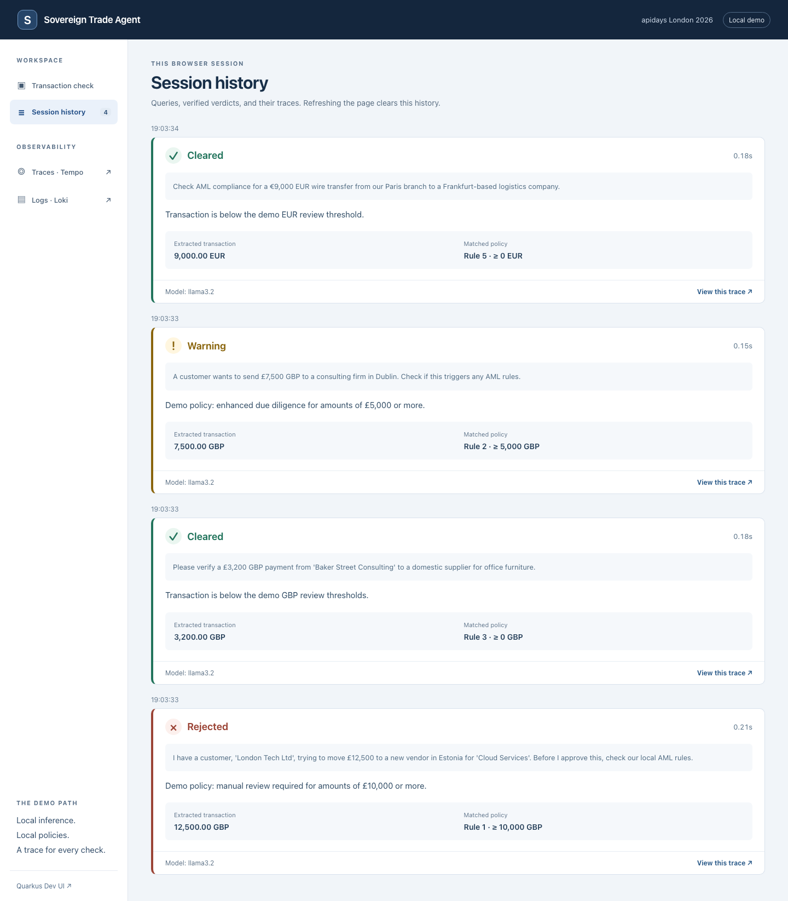
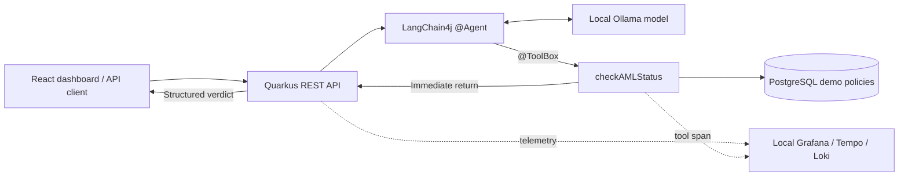

# Sovereign Trade Agent

A local AI and API demo for **apidays London 2026**. Describe a payment in natural language, let a Quarkus agent extract its amount and currency, and inspect the decision from a PostgreSQL policy table — including the exact OpenTelemetry trace.

Built with **Quarkus LangChain4j**, `@Agent`, `@ToolBox`, Ollama, PostgreSQL, React, and Grafana LGTM.

The AML thresholds are **illustrative demo policies**, not FCA regulatory rules or a complete compliance assessment. The [FCA describes a risk-based approach to AML](https://www.fca.org.uk/firms/financial-crime/money-laundering-terrorist-financing). Here, “Cleared” means no configured review threshold was triggered; “Rejected” represents the demo policy's manual-review outcome. No payment is executed.

## Quick start

Prerequisites:

- **JDK 25** (`java -version`); Maven is supplied by `./mvnw`.
- A running **Docker or Podman** container runtime for PostgreSQL and Grafana LGTM. With Podman on macOS, start your Podman machine and expose its Docker-compatible socket to Testcontainers.
- **Ollama running locally** on port 11434 is recommended for native GPU acceleration. Dev Services can start a container if no local instance exists, but inference speed depends on the container's GPU access.
- Internet access for the first dependency, container, and model downloads. Quinoa installs its configured Node/npm automatically.

Prepare the model before the event:

```bash
ollama pull llama3.2
```

Start the app:

```bash
./mvnw quarkus:dev
```

Dev Services starts PostgreSQL and Grafana LGTM, and reuses the local Ollama instance. The first startup takes longer while images and dependencies download.

- **App:** <http://localhost:8080>
- **Grafana:** <http://localhost:3001>
- **Quarkus Dev UI:** <http://localhost:8080/q/dev/>
- **Swagger UI:** <http://localhost:8080/q/swagger-ui/>

## The dashboard


- Four preset scenarios with expected outcomes for quick demo cycling.
- Structured verdicts from the policy tool, displayed immediately without a typing delay.
- Extracted amount, currency, matched rule, model name, and server duration.
- **View this trace** opens the specific request in Grafana Tempo.
- Inputs lock during a request; a 35-second browser timeout restores the retry button.
- Keyboard-accessible navigation and a responsive layout.



Session history lives in browser memory and clears on refresh. It is a demo convenience, not a durable audit store. A [mobile screenshot](assets/mobile_ui.png) shows the narrow layout.

## A short presentation sequence

1. **Before presenting:** start the app, wait for Grafana, then run `python3 scripts/check-demo.py --rounds 1`. This checks all four scenarios and warms the model.
2. **High-value GBP:** select £12,500 and run the analysis. Point out the extracted amount and policy rule 1.
3. **Follow the API:** click **View this trace**. Show the local model call and `checkAMLStatus` span with the amount and currency attributes.
4. **Compare outcomes:** run Standard GBP, Mid-range GBP, and EUR transfer. The model extracts the details; database rules supply the verdict.
5. **Show the trail:** open Session history, then Logs · Loki.

Repeat the checks shortly before going on stage so model loading and downloads are out of the presentation path. Rehearse once with external network access disconnected after setup; the configured inference, database, and telemetry services are local.

## Demo policies

Thresholds are **inclusive** (`amount >= threshold`); the highest matching threshold wins.

| Currency | Amount | Verdict |
|---|---|---|
| GBP | 0 < amount < £5,000 | CLEARED |
| GBP | £5,000 ≤ amount < £10,000 | WARNING |
| GBP | amount ≥ £10,000 | REJECTED |
| EUR | 0 < amount < €15,000 | CLEARED |
| EUR | amount ≥ €15,000 | REJECTED |
| USD | 0 < amount < $15,000 | CLEARED |
| USD | amount ≥ $15,000 | REJECTED |

The tool normalizes currency codes. Unknown currencies, missing rules, non-positive or non-finite amounts, and amounts with more than two decimal places require review. If the agent does not execute exactly one policy tool call, the application returns `REVIEW_REQUIRED` and never treats generated prose as approval.

The demo handles one transaction per request. Amount/currency extraction still depends on the model; the extracted values are visible for inspection.

## API

`POST /trade/analyze` accepts `text/plain` and returns structured JSON:

```bash
curl -sS http://localhost:8080/trade/analyze \
  -H 'Content-Type: text/plain' \
  -d 'Check a £12,500 GBP payment from London Tech Ltd.'
```

Example response (duration and trace ID vary):

```json
{
  "decision": {
    "verdict": "REJECTED",
    "message": "Demo policy: manual review required for amounts of £10,000 or more.",
    "amount": 12500.0,
    "currency": "GBP",
    "ruleId": 1,
    "threshold": 10000.0
  },
  "model": "llama3.2",
  "traceId": "<request trace ID>",
  "durationMs": 150
}
```

Blank inputs or inputs over 2,000 characters return HTTP 400. Dependency or agent execution failures return HTTP 503 with a short retry message. Both use the same response envelope with an `ERROR` verdict. Existing clients that expected a plain-text response should read `decision.verdict` and `decision.message` instead.

## How it works


```mermaid
flowchart LR
    UI[React dashboard / API client] --> API[Quarkus REST API]
    API --> Agent["LangChain4j @Agent"]
    Agent <--> Ollama[Local Ollama model]
    Agent -->|"@ToolBox"| Tool[checkAMLStatus]
    Tool --> DB[(PostgreSQL demo policies)]
    Tool -->|Immediate return| API
    API -->|Structured verdict| UI
    API -. telemetry .-> LGTM[Local Grafana / Tempo / Loki]
    Tool -. tool span .-> LGTM
```

The agent extracts the transaction and calls the policy tool. `ReturnBehavior.IMMEDIATE` ends inference after the tool, avoiding a second LLM call to paraphrase the result. The request-scoped tool retains the structured decision; the REST layer returns that decision and ignores generated text. Concurrent HTTP requests have isolated decision state.

`ErpClient` and its customer/transaction models remain extension points. The shipped agent does **not** call an ERP, and no ERP server is required. Ollama is the implemented model backend; a KServe deployment is not included.

## Keeping the demo fast

- Default model: **llama3.2**, with temperature 0 and a short output budget for tool calls.
- One model turn on the successful tool path; no LLM summary pass or simulated typing delay.
- A 2,048-token context window bounds memory use for these short requests.
- The configured Ollama call timeout is 30 seconds; the browser stops waiting at 35 seconds.

Run the repeatable API check to measure your own hardware:

```bash
python3 scripts/check-demo.py --rounds 3
```

It verifies the exact UI prompts, amounts, currencies, and verdicts. The first round is excluded from the reported warm median; subsequent rounds can benefit from Ollama's prompt cache. These timings are a rehearsal measurement, not a general model benchmark.

Local rehearsal on 14 September 2026: **llama3.2 passed all 12 checks**, with a warm median of **0.152 seconds** (maximum 0.165 seconds) on the final configuration. We also tried the smaller **qwen3:0.6b** with reasoning disabled. It returned quickly but failed all 12 checks by not producing valid tool calls, so llama3.2 remains the default. Results depend on hardware, model version, and cache state.

## Configuration and data flow

Configuration lives in `src/main/resources/application.properties`. Override the model and endpoint when starting dev mode, for example:

```bash
./mvnw quarkus:dev \
  -Dquarkus.langchain4j.ollama.chat-model.model-id=llama3.2 \
  -Dquarkus.langchain4j.ollama.base-url=http://localhost:11434
```

Grafana uses port 3001. The UI constructs its link from the browser hostname; for a different endpoint, set `VITE_GRAFANA_URL` before starting the frontend/app.

With the supplied development configuration, inference uses local Ollama, policies use a local PostgreSQL container, and telemetry uses local Grafana LGTM. Development request/response logging includes prompts, so use synthetic data for the presentation. Local deployment describes this demo's data path; sovereignty also depends on how the surrounding infrastructure is operated.

Tempo service filter: `service.name = sovereign-trade-agent`.


Loki query:

```logql
{service_name="sovereign-trade-agent"}
```

## Verification and screenshots

Backend tests cover policy boundaries, invalid inputs, tool-result handling, and the live local-model API scenarios. Run them with Quarkus continuous testing in dev mode (press `r`), or outside dev mode:

```bash
./mvnw test
```

Browser tests require Node.js 20+ and npm on your PATH. Browser regression tests use mocked API responses to check structured verdicts, locked inputs, timeouts, retry, history, and narrow layouts without invoking the LLM:

```bash
cd src/main/webui
npm ci
npx playwright install chromium
npm run test:ui
```

To refresh the README screenshots from **real local API responses** and verify the exact trace link while the app and Grafana are running:

```bash
CAPTURE_DEMO=1 npx playwright test tests/screenshots.spec.js
```

## Troubleshooting

- **Slow first check:** let the native Ollama model load, then run the rehearsal check again.
- **App startup fails:** confirm JDK 25, a working container runtime, and that ports 8080 and 3001 are available.
- **Analysis unavailable:** check Ollama and PostgreSQL in the dev console, then retry.
- **No trace yet:** allow a few seconds for telemetry export, then refresh Grafana.

## Learn more

- [Quarkus LangChain4j agentic workflows](https://docs.quarkiverse.io/quarkus-langchain4j/dev/agentic.html)
- [Ollama with Quarkus](https://docs.quarkiverse.io/quarkus-langchain4j/dev/guide-ollama.html)
- [LangChain4j immediate tool return](https://docs.langchain4j.dev/tutorials/tools/#immediate-return)
- [Quarkus OpenTelemetry](https://quarkus.io/guides/opentelemetry)
