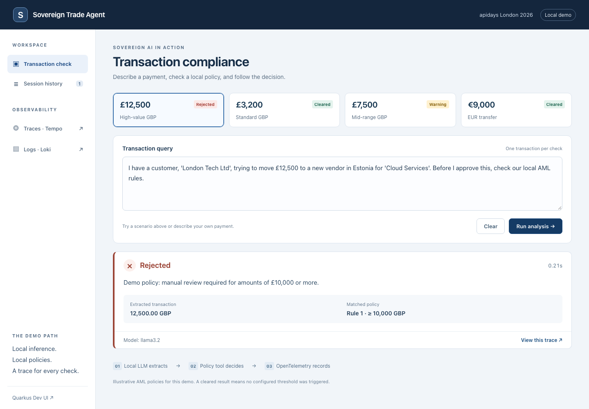
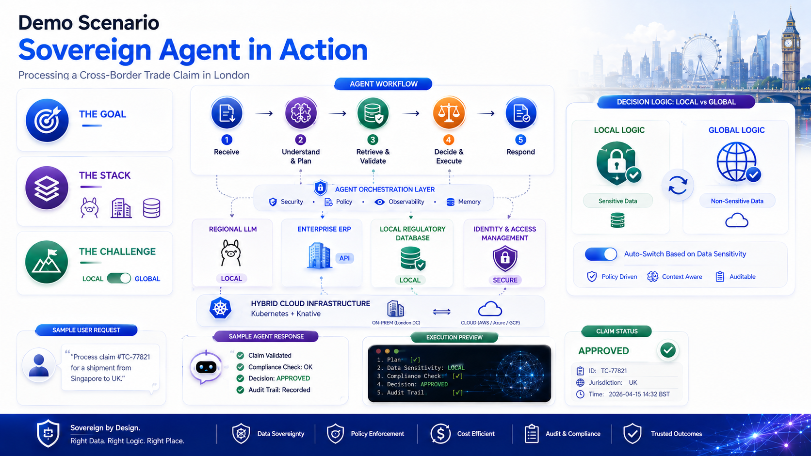
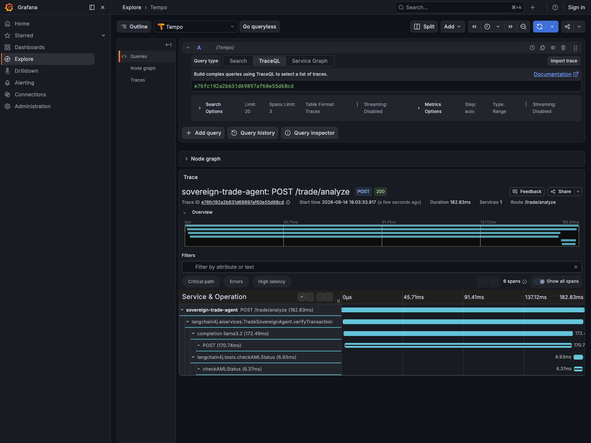
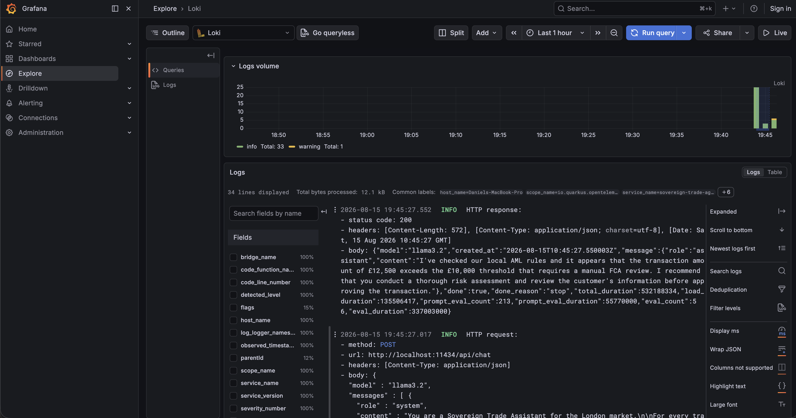

# Sovereign Trade Agent

An AI-powered trade compliance assistant for the London market that uses local LLMs to verify transactions against FCA anti-money laundering (AML) rules — with full data sovereignty guaranteed by running everything on-premise.

Built with [Quarkus LangChain4j](https://docs.quarkiverse.io/quarkus-langchain4j/dev/) using the `@Agent` annotation and `@ToolBox` for declarative agentic AI.

## Running the application in dev mode

Quarkus Dev Services will automatically start Ollama, PostgreSQL, and the Grafana LGTM observability stack:

```shell script
./mvnw quarkus:dev
```

## Web UI

Access the enterprise-style compliance dashboard at <http://localhost:8080>



The UI provides:
- **Scenario buttons** with color-coded tags (REJECT/WARN/CLEAR) for quick demo cycling
- **Color-coded compliance results** — red for REJECTED, amber for WARNING, green for CLEARED
- **Typing animation** with blinking cursor for AI agent responses
- **Audit log** — session transaction history as cards with verdict, query, response, and duration
- **Observability links** — direct links to Grafana Tempo (traces) and Loki (logs)

> **_NOTE:_** Quarkus Dev UI is available at <http://localhost:8080/q/dev/>

## Demo Scenario



### Test the AML Check Tool

Use the pre-built scenario buttons in the Web UI, or send a transaction query via curl:

```bash
curl -X POST http://localhost:8080/trade/analyze \
  -H "Content-Type: text/plain" \
  -d "I have a customer, 'London Tech Ltd', trying to move £12,500 to a new vendor in Estonia for 'Cloud Services'. Before I approve this, check our local AML rules."
```

**Expected Response:**
```
REJECTED: Manual FCA review required for amounts over £10k.
```

### Test Cases

| Amount | Currency | Expected Result |
|--------|----------|----------------|
| £12,500 | GBP | REJECTED (>£10k) |
| £7,500 | GBP | WARNING (>£5k) |
| £3,200 | GBP | CLEARED (≤£5k) |
| €9,000 | EUR | CLEARED (EUR within limits) |

### Verify Telemetry in Grafana

Grafana is available at <http://localhost:3001> (fixed port via Dev Services).

**Traces (Tempo):**

Click **Traces (Tempo)** in the Web UI sidebar, or open Grafana and select Tempo as the data source. Filter by `service.name = sovereign-trade-agent`.



**Logs (Loki):**

Click **Logs (Loki)** in the Web UI sidebar, or open Grafana and select Loki as the data source. Query: `{service_name="sovereign-trade-agent"}`.



## How It Works

1. **AI Agent** (`@Agent` + `@ToolBox`) extracts transaction details from natural language
2. **Tool Invocation** calls multiple tools:
   - `checkAMLStatus(amount, currency)` - Queries local regulatory database
   - `getCustomerInfo(customerId)` - Retrieves data from Enterprise ERP
3. **Data Integration** combines:
   - **Local Regulatory Database** - FCA AML rules (>£10k GBP requires review)
   - **Enterprise ERP** - Customer account details, risk levels, credit limits
4. **Response** returns comprehensive compliance assessment

### Architecture

```
                                    ┌─────────────────────────┐
                                    │   Regional LLM          │
                                    │   (KServe/Ollama)       │
                                    └───────────┬─────────────┘
                                                │
                                                ▼
User Query ──────────────────────────►  AI Agent (LangChain4j)
                                                │
                                                ▼
                                        ┌───────┴───────┐
                                        │  Tool Router  │
                                        └───┬───────┬───┘
                                            │       │
                    ┌───────────────────────┘       └──────────────────────┐
                    ▼                                                       ▼
        ┌─────────────────────────┐                         ┌─────────────────────────┐
        │ Local Regulatory DB     │                         │  Enterprise ERP         │
        │ (PostgreSQL)            │                         │  (REST API)             │
        │ - FCA AML Rules         │                         │ - Customer Data         │
        │ - Compliance Thresholds │                         │ - Account Info          │
        │ - Multi-currency        │                         │ - Risk Levels           │
        └─────────────────────────┘                         └─────────────────────────┘
                    │                                                       │
                    └───────────────────────┬───────────────────────────────┘
                                            ▼
                                  Compliance Assessment
                                            │
                                            ▼
                                    ┌───────────────┐
                                    │ OpenTelemetry │
                                    │  (LGTM Stack) │
                                    └───────────────┘
```

**Key Components:**

1. **Regional LLM (KServe/Ollama)** — runs locally for data sovereignty, processes natural language without external API calls
2. **Local Regulatory Database (PostgreSQL)** — FCA AML rules with multi-currency compliance thresholds, managed by Quarkus Dev Services
3. **Enterprise ERP Integration (REST Client)** — customer account information, risk assessment data, credit limits
4. **OpenTelemetry (LGTM Stack)** — end-to-end observability with Grafana, Tempo (traces), Loki (logs), and Mimir (metrics)

## Configuration

Edit `src/main/resources/application.properties`:

```properties
# LLM Model (must support tool calling)
quarkus.langchain4j.ollama.chat-model.model-id=llama3.2

# Ollama endpoint
quarkus.langchain4j.ollama.base-url=http://localhost:11434

# Grafana fixed port
quarkus.observability.lgtm.grafana-port=3001

# Enable log export to Loki
quarkus.otel.logs.enabled=true
```

## Learn More

- [Quarkus](https://quarkus.io/)
- [Quarkus LangChain4j](https://docs.quarkiverse.io/quarkus-langchain4j/dev/)
- [Quarkus LangChain4j Agentic](https://docs.quarkiverse.io/quarkus-langchain4j/dev/agentic.html)
- [Ollama](https://ollama.ai/)
