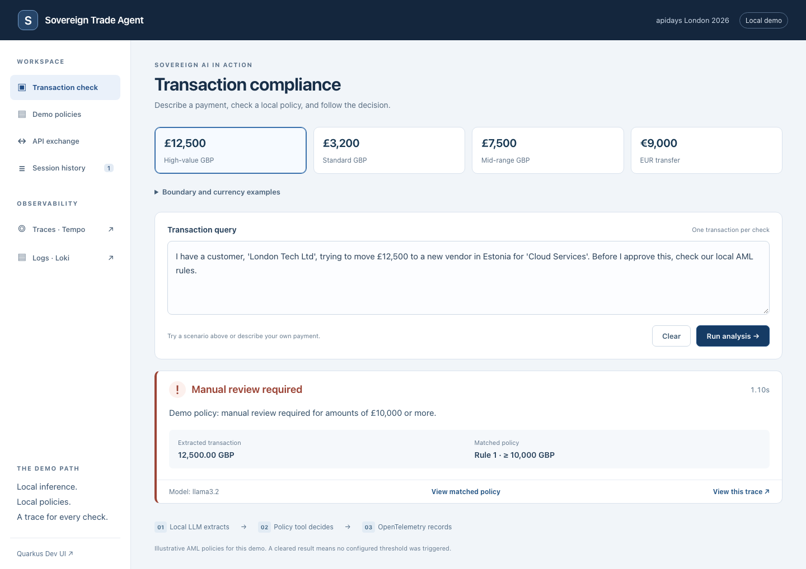
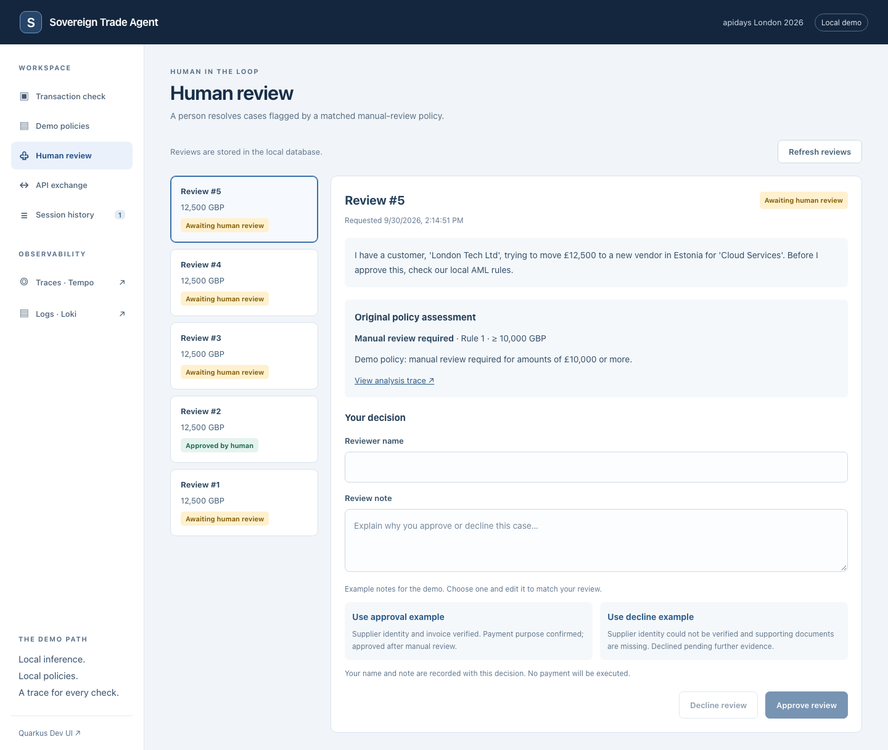
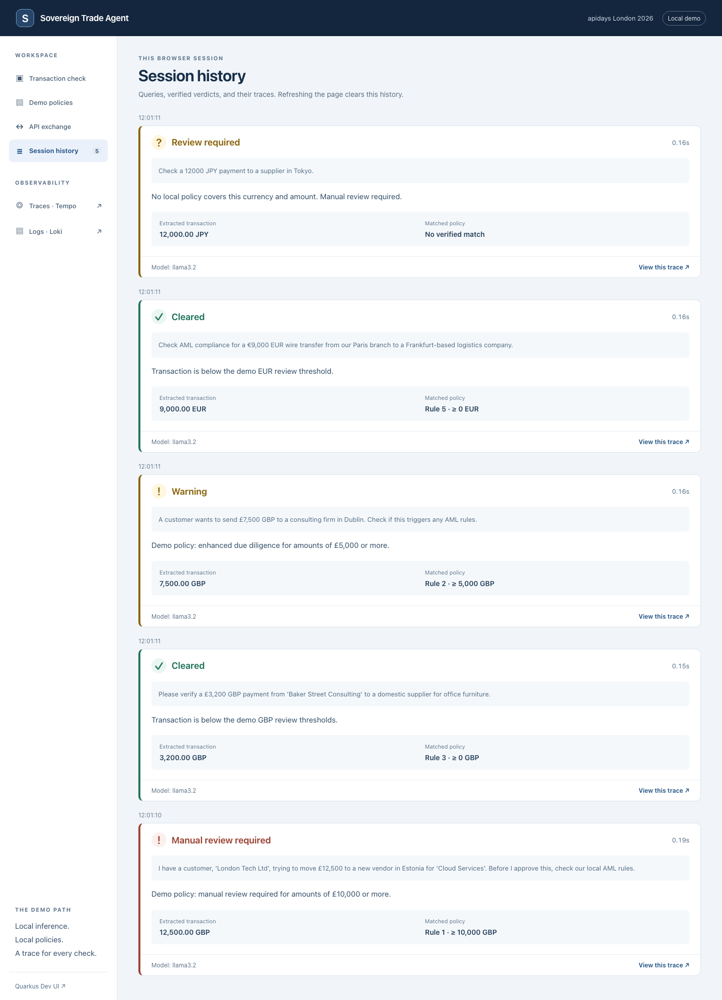
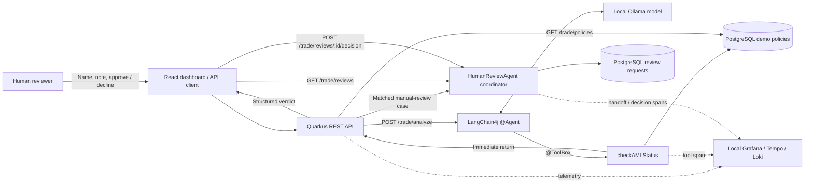
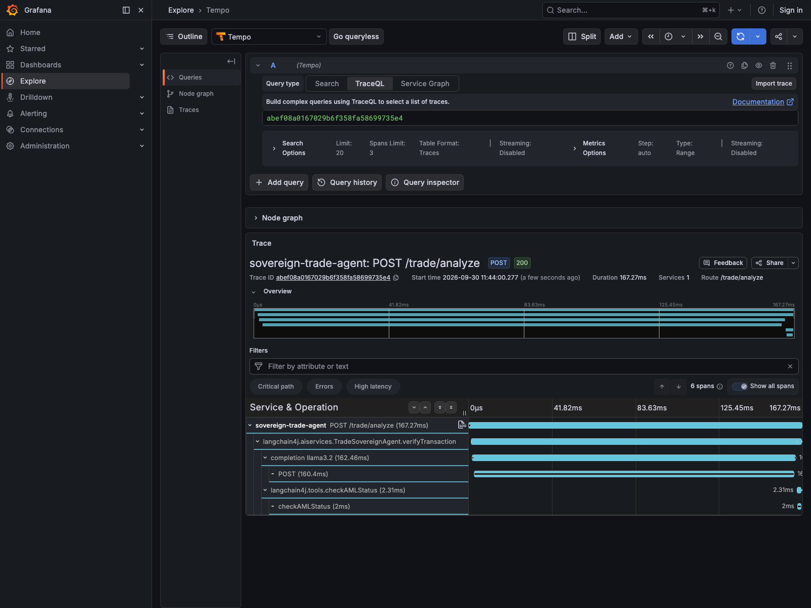

# Sovereign Trade Agent

A local AI and API demo for **apidays London 2026**. Describe a payment in natural language, let a Quarkus agent extract its amount and currency, and inspect the decision from a PostgreSQL policy table — including the exact OpenTelemetry trace.

Built with **Quarkus LangChain4j**, `@Agent`, `@ToolBox`, Ollama, PostgreSQL, React, and Grafana LGTM.

The AML thresholds are **illustrative demo policies**, not FCA regulatory rules or a complete compliance assessment. The [FCA describes a risk-based approach to AML](https://www.fca.org.uk/firms/financial-crime/money-laundering-terrorist-financing). Here, “Cleared” means no configured review threshold was triggered. The UI displays the legacy API verdict `REJECTED` as **Manual review required**; the demo never executes or rejects a payment.

## Quick start

Prerequisites:

- **JDK 25** (`java -version`); Maven is supplied by `./mvnw`.
- A running **Docker or Podman** container runtime for PostgreSQL and Grafana LGTM. With Podman on macOS, start your Podman machine and expose its Docker-compatible socket to Testcontainers.
- **Ollama running locally** on port 11434 is recommended for native GPU acceleration. Dev Services can start a container if no local instance exists, but inference speed depends on the container's GPU access.
- Internet access for the first dependency, container, and model downloads. Quinoa installs its configured Node/npm automatically.

Prepare the model before the event:

```bash
ollama pull llama3.2
```

Start the app:

```bash
./mvnw quarkus:dev
```

Dev Services starts PostgreSQL and Grafana LGTM, and reuses the local Ollama instance. The first startup takes longer while images and dependencies download.

- **App:** <http://localhost:8080>
- **Grafana:** <http://localhost:3001>
- **Quarkus Dev UI:** <http://localhost:8080/q/dev/>
- **Swagger UI:** <http://localhost:8080/q/swagger-ui/>
- **OpenAPI specification:** <http://localhost:8080/q/openapi>

## The dashboard



- Five preset scenarios for quick demo cycling, with verdicts revealed after analysis: three GBP payments, one EUR payment, and one JPY payment without policy coverage.
- Structured verdicts from the policy tool, displayed immediately without a typing delay.
- Extracted amount, currency, matched rule, model name, and server duration.
- **View this trace** opens the specific request in Grafana Tempo.
- **Open human review** hands a matched manual-review case to a person, with approval or decline recorded separately from the policy verdict.
- Inputs lock during a request; a 35-second browser timeout restores the retry button.
- Keyboard-accessible navigation and a responsive layout.

**Demo policies** reads the current rules from PostgreSQL through `GET /trade/policies`. Thresholds are inclusive, and the highest matching threshold wins. **View matched policy** opens this view from a result and highlights the latest matched rule if its ID, currency, threshold, and verdict still agree with the current database row. Rules are read-only in the demo.

[View the policy viewer screenshot](assets/policies.png).

**API exchange** shows the exact submitted request, HTTP status, and actual response body for the latest completed analysis. Editing the next query preserves that request/response pair. HTTP errors retain their status and body; a request with no HTTP response is identified separately. The view includes Swagger and OpenAPI links and a curl command with literal shell quoting for the request body.

[View the API exchange screenshot](assets/api_exchange.png).

The two review labels distinguish a matched policy requiring manual review (`REJECTED`) from an unverified transaction or missing policy coverage (`REVIEW_REQUIRED`). These API verdict codes remain unchanged for existing clients.

**Human review** lists the latest 50 review requests from PostgreSQL. A matched `REJECTED` result creates a `PENDING` request and returns its `reviewRequestId` immediately. Open it from the result, inspect the original query and matched policy, then enter a reviewer name and note and choose **Approve review** or **Decline review**. The recorded outcome, reviewer, note, time, and review trace remain visible after a browser refresh. An older request can still be opened from its analysis result even when it is outside the latest 50.



The form offers **Use approval example** and **Use decline example** to fill the note without submitting a decision. Edit the example to match what you checked:

- **Approve:** “Supplier identity and invoice verified. Payment purpose confirmed; approved after manual review.”
- **Decline:** “Supplier identity could not be verified and supporting documents are missing. Declined pending further evidence.”

[View a completed human review](assets/human_review_completed.png).

The original policy verdict remains `REJECTED`; the separate human status becomes `APPROVED` or `DECLINED`. Neither action executes a payment. Unsupported currencies such as JPY need policy coverage and do not get an approval form. Reviewer names are self-reported for this local demo; there is no authentication or reviewer-role enforcement. Review records survive browser refreshes, but the default Dev Services database and schema are recreated when dev mode restarts.



Session history lives in browser memory and clears on refresh. It is a demo convenience, not a durable audit store. A [mobile screenshot](assets/mobile_ui.png) shows the narrow layout.

## A short presentation sequence

1. **Before presenting:** start the app, wait for Grafana, then run `python3 scripts/check-demo.py --rounds 1`. This checks all five scenarios and warms the model.
2. **Run one payment:** select High-value GBP (£12,500). Show the extracted amount, **Manual review required**, and rule 1. Explain that no payment is executed.
3. **Show the evidence:** click **View matched policy** to see the actual PostgreSQL rule. The model extracts transaction details; the policy tool determines the outcome.
4. **Bring in a person:** click **Open human review**, add a reviewer name and note, and approve or decline the request. Show that the original policy evidence remains unchanged. Refresh the browser and open Human review to demonstrate the saved decision. Session history resets on refresh, so skip the refresh if keeping it for the final step.
5. **Compare outcomes:** return to Transaction check and run Standard GBP, Mid-range GBP, and EUR transfer. Then run JPY transfer: no configured policy covers JPY, so the app returns Review required with no matched rule or approval form.
6. **Reuse the API:** open API exchange to show the submitted request and JSON response. Open Swagger UI and show `POST /trade/analyze` plus the review endpoints.
7. **Follow the execution:** return to the result and click **View this trace**. Show the local model call and `checkAMLStatus` span. A high-value analysis also contains `requestHumanReview`; the separate human decision trace contains `recordHumanDecision`. Finish with Session history.

To demonstrate an exact policy boundary during questions, edit the transaction query to compare £9,999 and £10,000. The inclusive GBP threshold is also covered by backend tests.

Presentation message: **Natural language enters through an API; local policies determine the outcome; a person resolves flagged cases; traces show both steps.** OpenAPI describes the HTTP endpoints. The agent invokes the policy tool as a Java method through `@ToolBox`; it does not discover tools from an OpenAPI document. Inference uses Ollama's HTTP API.

Repeat the checks shortly before going on stage so model loading and downloads are out of the presentation path. Rehearse once with external network access disconnected after setup; the configured inference, database, and telemetry services are local.

## Demo policies

Thresholds are **inclusive** (`amount >= threshold`); the highest matching threshold wins.

| Currency | Amount | Verdict |
|---|---|---|
| GBP | 0 < amount < £5,000 | CLEARED |
| GBP | £5,000 ≤ amount < £10,000 | WARNING |
| GBP | amount ≥ £10,000 | REJECTED |
| EUR | 0 < amount < €15,000 | CLEARED |
| EUR | amount ≥ €15,000 | REJECTED |
| USD | 0 < amount < $15,000 | CLEARED |
| USD | amount ≥ $15,000 | REJECTED |

The tool normalizes currency codes. Unknown currencies, missing rules, non-positive or non-finite amounts, and amounts with more than two decimal places require review. If the agent does not execute exactly one policy tool call, the application returns `REVIEW_REQUIRED` and never treats generated prose as approval.

The demo handles one transaction per request. Amount/currency extraction still depends on the model; the extracted values are visible for inspection.

## API

`POST /trade/analyze` accepts `text/plain` and returns structured JSON:

```bash
curl -sS http://localhost:8080/trade/analyze \
  -H 'Content-Type: text/plain' \
  -d 'Check a £12,500 GBP payment from London Tech Ltd.'
```

Example response (duration and trace ID vary):

```json
{
  "decision": {
    "verdict": "REJECTED",
    "message": "Demo policy: manual review required for amounts of £10,000 or more.",
    "amount": 12500.0,
    "currency": "GBP",
    "ruleId": 1,
    "threshold": 10000.0
  },
  "model": "llama3.2",
  "traceId": "<request trace ID>",
  "durationMs": 150,
  "reviewRequestId": 1
}
```

Blank inputs or inputs over 2,000 characters return HTTP 400. Dependency or agent execution failures return HTTP 503 with a short retry message. Both use the same response envelope with an `ERROR` verdict. Existing clients that expected a plain-text response should read `decision.verdict` and `decision.message` instead.

`GET /trade/policies` returns the current database rules, ordered by currency and descending threshold:

```bash
curl -sS http://localhost:8080/trade/policies -H 'Accept: application/json'
```

Each rule contains `id`, `currency`, `threshold`, `verdict`, and `description`. The rule ID and threshold correspond to `decision.ruleId` and `decision.threshold` in the analysis response. No policy editing endpoint is provided. The OpenAPI specification documents the analysis response envelope for HTTP 200, 400, and 503, along with the policy and human review endpoints.

`reviewRequestId` is non-null only for a matched manual-review policy. Use `GET /trade/reviews` to list the latest 50 requests, or `GET /trade/reviews/{id}` to retrieve a specific request. Record the human decision with JSON:

```bash
curl -sS http://localhost:8080/trade/reviews/1/decision \
  -H 'Content-Type: application/json' \
  -d '{"outcome":"APPROVED","reviewer":"Daniel","note":"Supplier details checked for this demo."}'
```

Use the ID returned by analysis. `outcome` accepts `APPROVED` or `DECLINED`; reviewer name (1–80 characters) and note (1–1,000 characters) are required. The response contains the original query and decision snapshot, status, reviewer, note, timestamps, and analysis/review trace IDs. An identical retry returns the saved decision without changing its audit fields. A conflicting decision returns HTTP 409, invalid fields return 400, and a missing request returns 404. Concurrent reviewers cannot overwrite a recorded decision.

## How it works


```mermaid
flowchart LR
    UI[React dashboard / API client] --> API[Quarkus REST API]
    API -->|"POST /trade/analyze"| Agent["LangChain4j @Agent"]
    Agent <--> Ollama[Local Ollama model]
    Agent -->|"@ToolBox"| Tool[checkAMLStatus]
    Tool --> DB[(PostgreSQL demo policies)]
    API -->|"GET /trade/policies"| DB
    Tool -->|Immediate return| API
    API -->|Structured verdict| UI
    API -->|Matched manual-review case| Review[HumanReviewAgent coordinator]
    Review --> Reviews[(PostgreSQL review requests)]
    UI -->|"GET /trade/reviews"| Review
    Human[Human reviewer] -->|Name, note, approve / decline| UI
    UI -->|"POST /trade/reviews/:id/decision"| Review
    API -. telemetry .-> LGTM[Local Grafana / Tempo / Loki]
    Tool -. tool span .-> LGTM
    Review -. handoff / decision spans .-> LGTM
```

The agent extracts the transaction and calls the policy tool. `ReturnBehavior.IMMEDIATE` ends inference after the tool, avoiding a second LLM call to paraphrase the result. The request-scoped tool retains the structured decision; the REST layer returns that decision and ignores generated text. Concurrent HTTP requests have isolated decision state.

`HumanReviewAgent` is a deterministic CDI coordinator for a human-in-the-loop (HITL) handoff, not another LLM agent. It saves a snapshot of the verified policy evidence and returns immediately. The browser later submits a real person's decision through a separate HTTP request; analysis does not block waiting for a human. This simple demo does not use LangChain4j's suspended `@HumanInTheLoop` workflow, and the model has no tool for approving reviews.

The demo uses local Ollama inference and a PostgreSQL policy table. No ERP server is required; a KServe deployment is not included.

## Keeping the demo fast

- Default model: **llama3.2**, with temperature 0 and a short output budget for tool calls.
- One model turn on the successful tool path; no LLM summary pass or simulated typing delay.
- A 2,048-token context window bounds memory use for these short requests.
- The configured Ollama call timeout is 30 seconds; the browser stops waiting at 35 seconds.

Run the repeatable API check to measure your own hardware:

```bash
python3 scripts/check-demo.py --rounds 3
```

It verifies all five exact UI prompts, amounts, currencies, verdicts, matched rule IDs, and human-review handoffs, including the absence of a match or approval request for JPY. Each high-value check creates a pending review request; the rehearsal script does not resolve it. The first round is excluded from the reported warm median; subsequent rounds can benefit from Ollama's prompt cache. These timings are a rehearsal measurement, not a general model benchmark.

Local rehearsal on 14 September 2026, using the original four presets over three rounds: **llama3.2 passed all 12 checks**, with a warm median of **0.152 seconds** (maximum 0.165 seconds). We also tried the smaller **qwen3:0.6b** with reasoning disabled. It returned quickly but failed all 12 checks by not producing valid tool calls, so llama3.2 remains the default. Results depend on hardware, model version, and cache state.

## Configuration and data flow

Configuration lives in `src/main/resources/application.properties`. Override the model and endpoint when starting dev mode, for example:

```bash
./mvnw quarkus:dev \
  -Dquarkus.langchain4j.ollama.chat-model.model-id=llama3.2 \
  -Dquarkus.langchain4j.ollama.base-url=http://localhost:11434
```

Grafana uses port 3001. The UI constructs its link from the browser hostname; for a different endpoint, set `VITE_GRAFANA_URL` before starting the frontend/app.

Quinoa excludes `/trade` and `/q` from its frontend routing so API requests reach Quarkus directly. The standalone Vite server proxies both prefixes to `http://localhost:8080`, including Swagger and OpenAPI links.

With the supplied development configuration, inference uses local Ollama, policies use a local PostgreSQL container, and telemetry uses local Grafana LGTM. Development request/response logging includes prompts, so use synthetic data for the presentation. Local deployment describes this demo's data path; sovereignty also depends on how the surrounding infrastructure is operated.

Tempo service filter: `service.name = sovereign-trade-agent`.



Loki query:

```logql
{service_name="sovereign-trade-agent"}
```

## Verification and screenshots

Backend tests cover policy boundaries, invalid inputs, tool-result handling, live local-model API scenarios, OpenAPI response schemas, the policy endpoint reading changed database values, review persistence, required reviewer fields, idempotent retries, and concurrent decisions. Run them with Quarkus continuous testing in dev mode (press `r`), or outside dev mode:

```bash
./mvnw test
```

Browser tests require Node.js 20+ and npm on your PATH. Browser regression tests use mocked API responses to check structured verdicts, locked inputs, timeouts, retry, history, policy matching, API request/response pairing, unsupported currency handling, human approval/decline, conflict refresh, saved reviews after reload, and narrow layouts without invoking the LLM:

```bash
cd src/main/webui
npm ci
npx playwright install chromium
npm run test:ui
```

To refresh the README screenshots from **real local API responses** and verify the exact trace link while the app and Grafana are running:

```bash
CAPTURE_DEMO=1 npx playwright test tests/screenshots.spec.js
```

## Troubleshooting

- **Slow first check:** let the native Ollama model load, then run the rehearsal check again.
- **App startup fails:** confirm JDK 25, a working container runtime, and that ports 8080 and 3001 are available.
- **Analysis unavailable:** check Ollama and PostgreSQL in the dev console, then retry.
- **No trace yet:** allow a few seconds for telemetry export, then refresh Grafana.

## Learn more

- [Quarkus LangChain4j agentic workflows](https://docs.quarkiverse.io/quarkus-langchain4j/dev/agentic.html)
- [Ollama with Quarkus](https://docs.quarkiverse.io/quarkus-langchain4j/dev/guide-ollama.html)
- [LangChain4j immediate tool return](https://docs.langchain4j.dev/tutorials/tools/#immediate-return)
- [Quarkus OpenTelemetry](https://quarkus.io/guides/opentelemetry)
